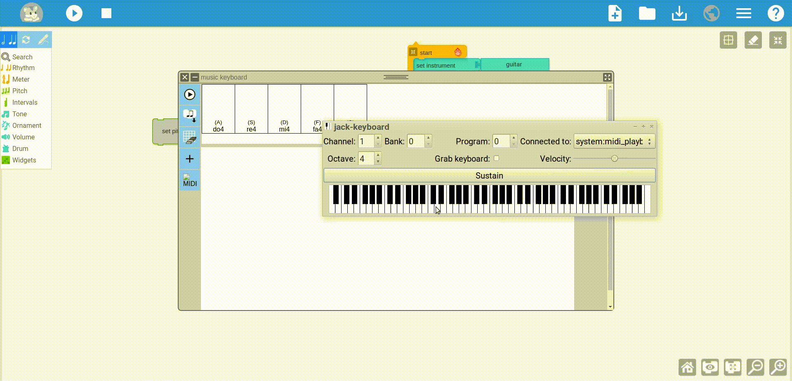
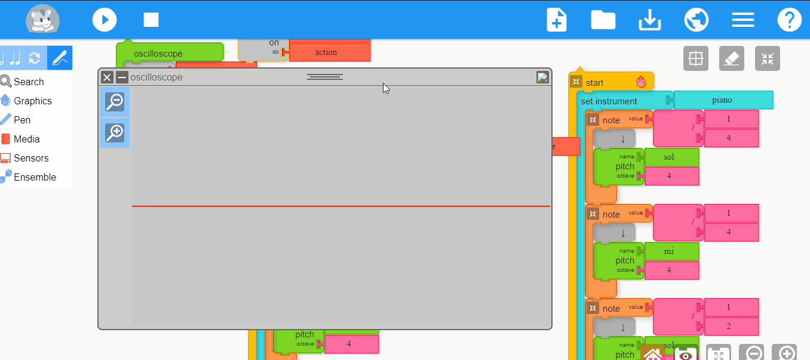
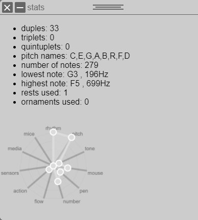
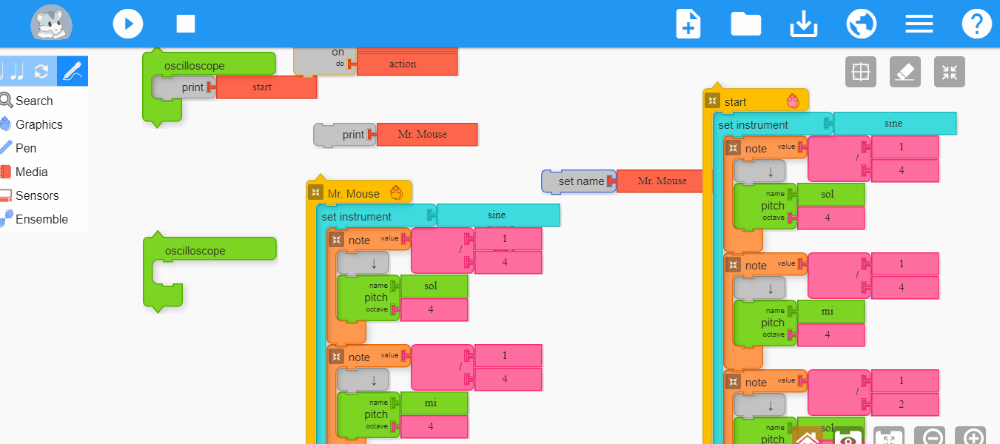
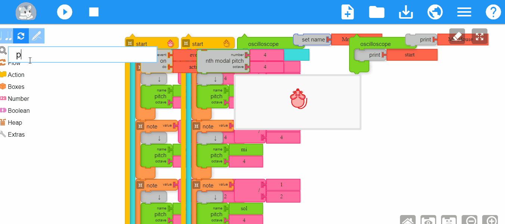
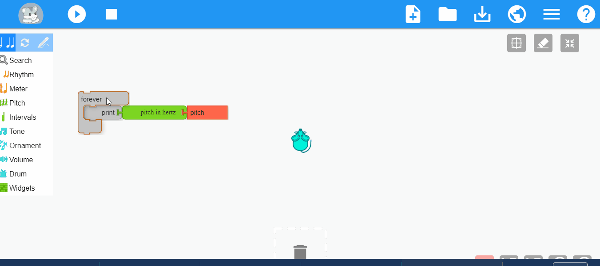

# Google Summer Of Code 2020 - Final Work Product
 
### sugarlabs/[musicblocks](https://github.com/sugarlabs/musicblocks) 
#### author:sksum ([Saksham Mrig](https://github.com/sksum)) 
#### Project Details 
- Project Title: **Resolve 100 issues in Music Blocks**
- Proposal: [ Proposal ](summerofcode.withgoogle.com/projects/#6367628337086464)
- Organization: [Sugarlabs](https://github.com/sugarlabs/)

## Abstract/Summary 
Spending the summer of 2020 working on MusicBlocks has been an amazing experience .
I'm very grateful to Sugarlabs for accepting my contributions and supporting me through the process of fixing bugs and adding new features. 
For the past 4 months I along with my peers have been working tirelessly to make musicblocks better. I have successfully added new features, widgets, new Blocks and also refactored a lot of code.
___
## Highlights
- MusicKeyboard and Midi:  
    The MusicKeyboard widget in MusicBlocks now considers BPM and Tempo info to generate notes . 
    The MusicKeyboard widget now accepts Midi keyboard (usb) as an input source with the help of the [Web MIDI API](https://www.w3.org/TR/webmidi/) . There are still some performance issues with the [.mid file input]()
    &nbsp;

    
    &nbsp;

- Widgets:  
    Oscilloscope widget was added this summer which allows users to visualize their music waveforms .
    &nbsp;

    
    &nbsp;

    Issues related to temperament widget and the pitch slider were mostly resolved .
    Statistics are now displaed as a widget and we have added new Stats which are better oriented for musical parameters and some of them are used to suggest tags when publishing.
    &nbsp;

    
    &nbsp;

- Palette & Pelette menu:  
    Palette and Palette menu buttons now use simple HTML/CSS instead of CreateJS ,this has made the user experience much smoother and also handles any issues pertaining to layout distortion on resize .
    &nbsp;

    
    &nbsp;

- on everybeatdo:  
    This is a new block which uses a seperate turtle as a beat compainion to run tasks on every beat regardless of note playing , whereas the **on everynotedo** block only worked when a note was queued in the project .
- Search:  
    I helped revamp the JqueryUI Search widget to use searchIds for to use images as identifiers .
    &nbsp;

    
    &nbsp;

- New Blocks:  
    Some of the blocks I helped develop this summer were :
    - Pitch Analyser : Converts audio input to musical pitch .
     For more Info - https://musicblocks.net/2020/07/15/how-to-make-a-tuner-with-music-blocks/
    - Panning : alows mixinig capabilities 
    
    &nbsp;
    along with hover sensors , crescendo , set grid etc

    &nbsp;

    
    &nbsp;

Thank You for Reading  

Regards - 
Saksham Mrig  

&nbsp;&nbsp;&nbsp;&nbsp;&nbsp;&nbsp;

Contact:
- [LinkedIn](https://www.linkedin.com/in/saksham-mrig-b772851a3/)
- [Github](https://github.com/sksum)
